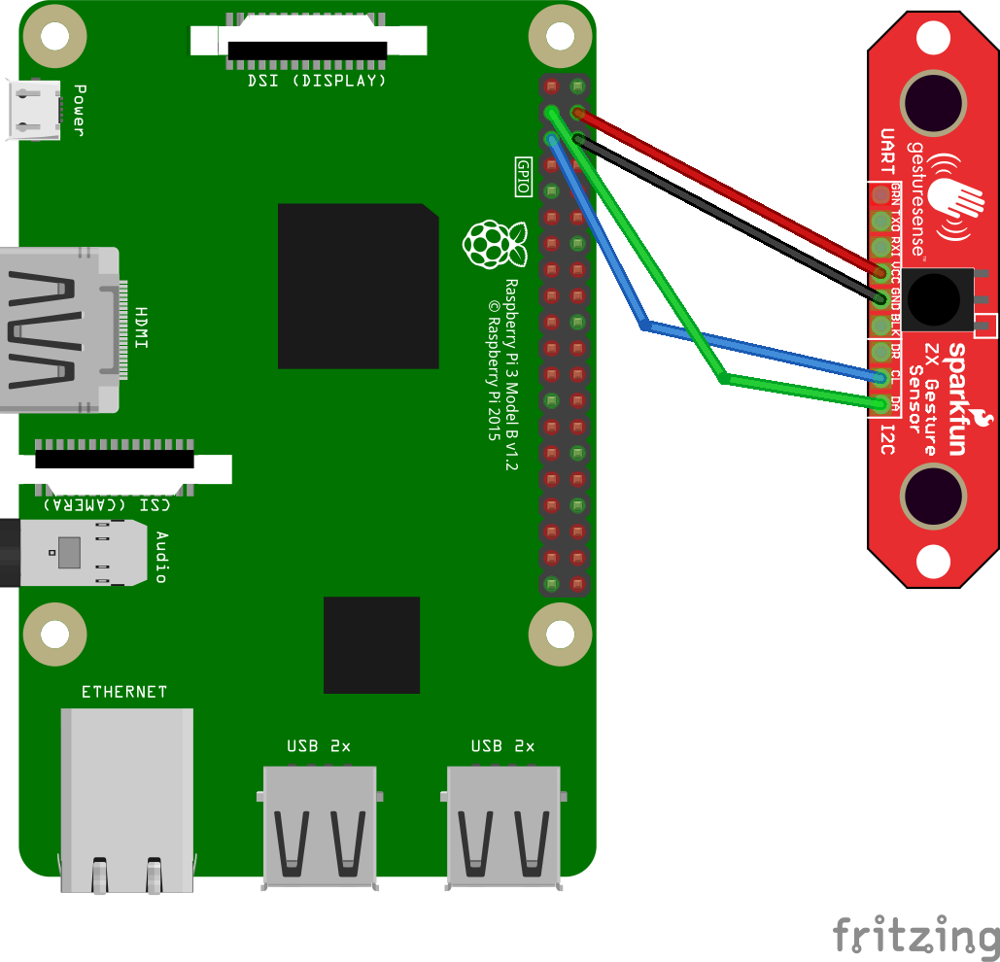

# Module: zxgesture

Sparkfun ZX Gesture Sensor module for MagicMirror.

## Installation
In your terminal, go to your MagicMirror's Module folder:
````
cd ~/MagicMirror/modules
````

Clone this repository:
````
git clone https://github.com/muharremtac/zxgesture.git
````

Go to the modules folder:
````
cd zxgesture
````

Install the dependencies:
````
npm install --production
````

## Wiring


## Configuration

Add the module to the modules array in the `config/config.js` file:
````javascript
{
    module: 'zxgesture'
},
````

## Config Options
| **Option** | **Default** | **Description** |
| --- | --- | --- |
| `width` | '500px' | **Optional** Image width |
| `images` | some images | **Optional** array of images eg ["image1","image2"] |

## Config Examples
````javascript
{
    module: 'zxgesture',
    position: 'middle_center',
    config: {
        width:"500px",
        images:["https://www.muharremtac.com/wp-content/uploads/2016/08/IMG_0236.jpg",
         "https://www.muharremtac.com/wp-content/uploads/2016/08/IMG_1984.jpg",
         "https://www.muharremtac.com/wp-content/uploads/2016/08/IMG_0246.jpg"]
    }
},
````